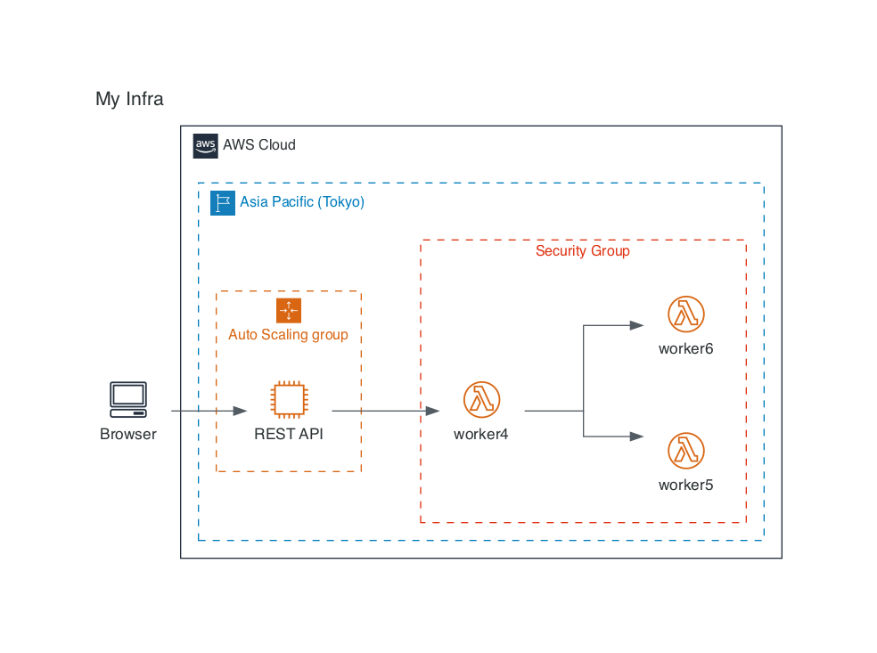

[](https://opensource.org/licenses/MIT)
[](https://github.com/prettier/prettier)
[](http://makeapullrequest.com) <!-- ALL-CONTRIBUTORS-BADGE:START - Do not remove or modify this section -->
[](#contributors)
<!-- ALL-CONTRIBUTORS-BADGE:END -->

# rediagram

Markup and draw your system diagrams with React.

## Key Feature

### Draw Your System with JSX/TSX

Code your system architecture in the style of React, JSX/TSX.

[MyInfra.rediagram.tsx](./examples/gallery/src/MyInfra.rediagram.tsx)

```tsx
import React from 'react';
import { PNG, Diagram, GeneralIcon } from 'rediagram';
import { AWS, InvizAWS, EC2, Lambda, Region, SecurityGroup, AutoScalingGroup } from '@rediagram/aws';

PNG(
  <Diagram title="My Infra">
    <InvizAWS>
      <AWS>
        <Region name="Asia Pacific (Tokyo)">
          <AutoScalingGroup>
            <EC2 name="REST API" type="Instance" upstream={['worker4']} />
          </AutoScalingGroup>
          <SecurityGroup>
            <Lambda name="worker4" type="Lambda Function" upstream={['worker5', 'worker6']} />
            <Lambda name="worker5" type="Lambda Function" />
            <Lambda name="worker6" type="Lambda Function" />
          </SecurityGroup>
        </Region>
      </AWS>
      <GeneralIcon name="Browser" type="Client" upstream={['REST API']} />
    </InvizAWS>
  </Diagram>,
);
```

Running this file will generate a diagram of `MyInfra.rediagram.png`.

```bash
$ ts-node MyInfra.rediagram.tsx
```



You can choose PNG, SVG, or PDF as the output format.

See [more examples](./examples/gallery/README.md).

> Note:
> Do you want to execute them all at once?
>
> We provide the rediagramc command that generates images at once by matching the patterns of `**/*.rediagram.tsx`.
>
> See [@rediagram/cli](./packages/cli/README.md) for more details.

### Easy to setup

You can set up a project with one command by using [create-rediagram-project](./packages/create-rediagram-project/README.md).

```bash
# yarn create rediagram-project <project-name>
$ yarn create rediagram-project my-rediagram
  🌈 Creating new rediagram project in my-rediagram.
  ...
```

See this document for [more information](https://kamiazya.github.io/rediagram/docs/getting-started/setup-project).

## Packages

- Core
  - [rediagram](./packages/rediagram/README.md) - Common components for drawing diagrams and functions for image output.
  - [@rediagram/cli](./packages/cli/README.md) - CLI for rediagram.
  - [@rediagram/cdk](./packages/cdk/README.md) - Component Development Kit for rediagram library.
  - [@rediagram/tsconfig](./packages/tsconfig/README.md) - A base TSConfig for working with rediagram.
  - [@rediagram/common](./packages/common/README.md)  - Common config and utility for rediagram.
- Component Libraries
  - [@rediagram/aws](./packages/aws/README.md) - Components for drawing AWS diagrams.
  - [@rediagram/gcp](./packages/gcp/README.md) - Components for drawing GCP diagrams.
  - [@rediagram/firebase](./packages/firebase/README.md) - Components for drawing Firebase diagrams.
  - etc,
    - We have no plans yet, but welcome contributions.
- Miscellaneous
  - [create-rediagram-project](./packages/create-rediagram-project/README.md) - Starter kit for rediagram.
  - [@rediagram/docker-runtime](./docker/README.md) - rediagram runtime for Docker. 
- Examples
  - [Gallery](./examples/gallery/README.md)

## Requirement

This project requires Graphviz.
If you don't have it installed, install it [here](https://graphviz.gitlab.io/download/).

## Contributors

Thanks goes to these wonderful people ([emoji key](https://allcontributors.org/docs/en/emoji-key)):

<!-- ALL-CONTRIBUTORS-LIST:START - Do not remove or modify this section -->
<!-- prettier-ignore-start -->
<!-- markdownlint-disable -->
<table>
  <tbody>
    <tr>
      <td align="center" valign="top" width="14.28%"><a href="http://blog.kamiazya.tech/"><br /><sub><b>Yuki Yamazaki</b></sub></a><br /><a href="https://github.com/kamiazya/rediagram/commits?author=kamiazya" title="Code">💻</a> <a href="#content-kamiazya" title="Content">🖋</a> <a href="#design-kamiazya" title="Design">🎨</a> <a href="#example-kamiazya" title="Examples">💡</a></td>
      <td align="center" valign="top" width="14.28%"><a href="https://github.com/odd12258053"><br /><sub><b>odd</b></sub></a><br /><a href="https://github.com/kamiazya/rediagram/issues?q=author%3Aodd12258053" title="Bug reports">🐛</a></td>
      <td align="center" valign="top" width="14.28%"><a href="http://lonesec.com"><br /><sub><b>fealone</b></sub></a><br /><a href="#ideas-fealone" title="Ideas, Planning, & Feedback">🤔</a> <a href="https://github.com/kamiazya/rediagram/commits?author=fealone" title="Tests">⚠️</a> <a href="https://github.com/kamiazya/rediagram/issues?q=author%3Afealone" title="Bug reports">🐛</a></td>
      <td align="center" valign="top" width="14.28%"><a href="https://github.com/78hack"><br /><sub><b>78hack</b></sub></a><br /><a href="https://github.com/kamiazya/rediagram/commits?author=78hack" title="Code">💻</a> <a href="https://github.com/kamiazya/rediagram/issues?q=author%3A78hack" title="Bug reports">🐛</a></td>
      <td align="center" valign="top" width="14.28%"><a href="https://github.com/tokidrill"><br /><sub><b>YukiSasaki</b></sub></a><br /><a href="#ideas-tokidrill" title="Ideas, Planning, & Feedback">🤔</a></td>
      <td align="center" valign="top" width="14.28%"><a href="https://github.com/yamatatsu"><br /><sub><b>Tatsuya Yamamoto</b></sub></a><br /><a href="https://github.com/kamiazya/rediagram/commits?author=yamatatsu" title="Code">💻</a></td>
      <td align="center" valign="top" width="14.28%"><a href="https://portfolio.tubone-project24.xyz/"><br /><sub><b>tubone(Yu Otsubo)</b></sub></a><br /><a href="https://github.com/kamiazya/rediagram/issues?q=author%3Atubone24" title="Bug reports">🐛</a></td>
    </tr>
    <tr>
      <td align="center" valign="top" width="14.28%"><a href="https://github.com/mattfirtion"><br /><sub><b>mattfirtion</b></sub></a><br /><a href="https://github.com/kamiazya/rediagram/issues?q=author%3Amattfirtion" title="Bug reports">🐛</a> <a href="https://github.com/kamiazya/rediagram/commits?author=mattfirtion" title="Code">💻</a></td>
    </tr>
  </tbody>
</table>

<!-- markdownlint-restore -->
<!-- prettier-ignore-end -->

<!-- ALL-CONTRIBUTORS-LIST:END -->

This project follows the [all-contributors](https://github.com/all-contributors/all-contributors)
specification. Contributions of any kind welcome!

## License

This software is released under the MIT License, see [LICENSE](./LICENSE).
