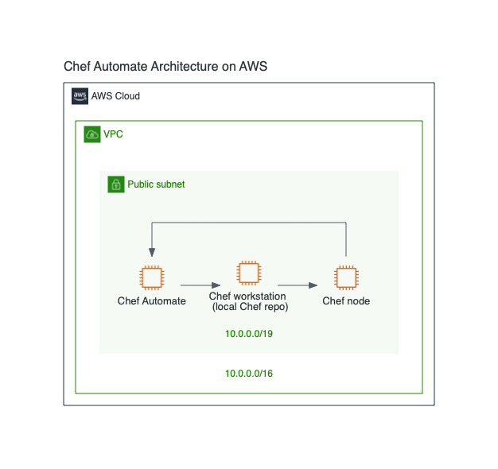

# rediagram

## [My Infra](./examples/gallery/src/MyInfra.tsx)


## [Git to S3 WebHooks](./examples/gallery/src/GitToS3WebHooks.tsx)


## [Chef Automate Architecture on AWS](./examples/gallery/src/ChefAutomateArchitectureOnAWS.tsx)



## [MDX](./examples/mdx/MyInfra.mdx)

```md
# My Infra

This is My awesome infra.

<Diagram title="My Infra">
  <AWS>
    <Region name="Asia Pacific (Tokyo)">
      <AutoScalingGroup>
        <EC2 name="REST API" type="Instance" upstream={['worker4']} />
      </AutoScalingGroup>
      <SecurityGroup>
        <Lambda name="worker4" type="Lambda Function" upstream={['worker5', 'worker6']} />
        <Lambda name="worker5" type="Lambda Function" />
        <Lambda name="worker6" type="Lambda Function" />
      </SecurityGroup>
    </Region>
  </AWS>
  <AWSGeneralIcon name="Browser" type="Client" upstream={['REST API']} />
</Diagram>
```

```html
<h1>My Infra</h1>
<p>This is My awesome infra.</p>

```
