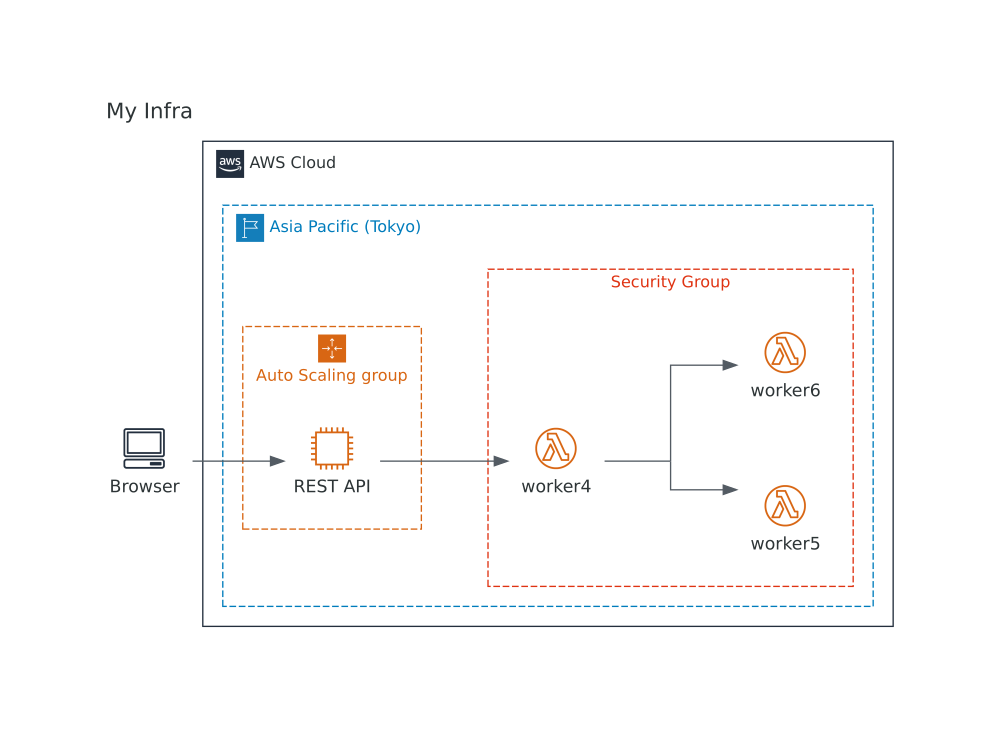
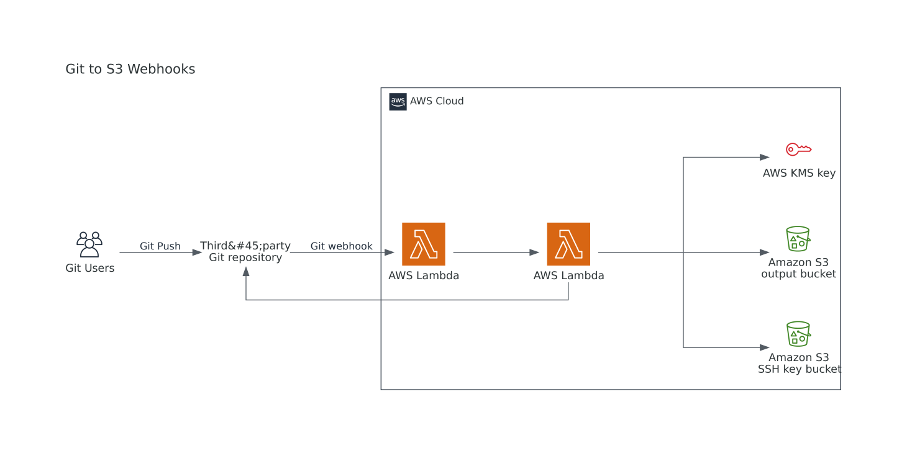
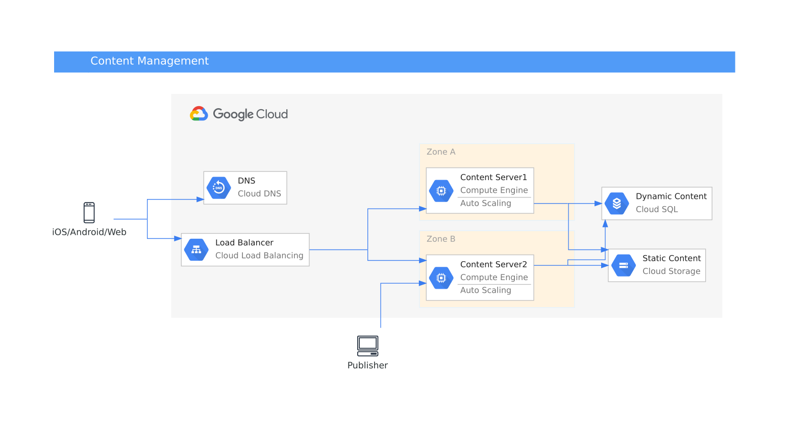

# @rediagram/gallery

## AWS

### [My Infra](./src/MyInfra.rediagram.tsx)

### [Git to S3 WebHooks](./src/GitToS3WebHooks.rediagram.tsx)

### [Chef Automate Architecture on AWS](./src/ChefAutomateArchitectureOnAWS.rediagram.tsx)

## GCP

### [App Engine and Cloud Endpoints](./src/AppEngineAndCloudEndpoints.rediagram.tsx)

### [Content Management](./src/ContentManagement.rediagram.tsx)

